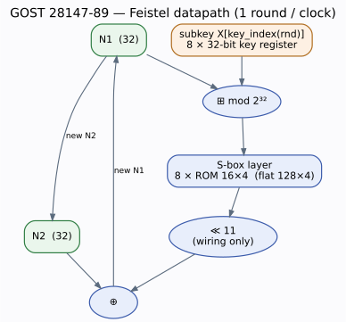
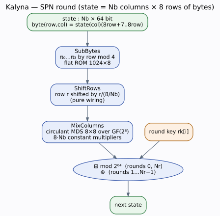
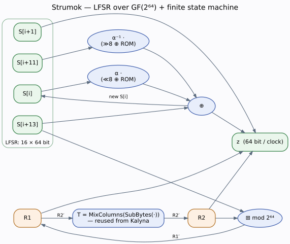
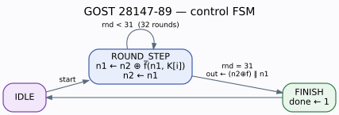
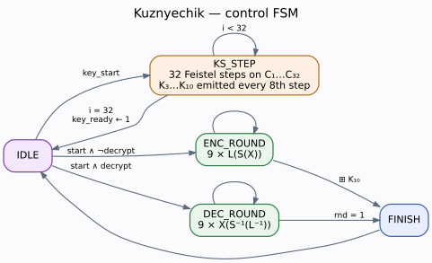
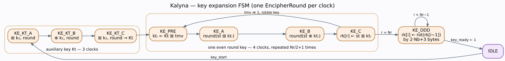
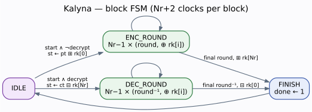
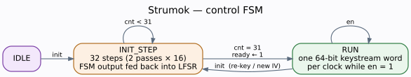
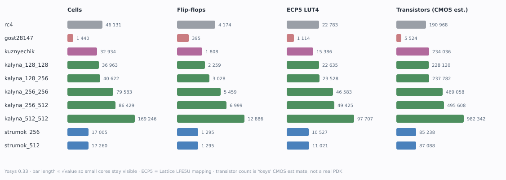

# Symmetric Ciphers in VHDL

Synthesisable RTL implementations of five symmetric ciphers — the Ukrainian
DSTU standards, their Russian GOST counterparts, and RC4 as a baseline — each
with a self-checking testbench validated against published test vectors, and
each carried through synthesis to gate and transistor counts.

**English** · [Українська](README.uk.md) · [Русский](README.ru.md)


---

## What's here

| Cipher | Standard | Structure | Block / Key | Rounds | Status |
|---|---|---|---|---|---|
| **Kalyna** (Калина) | DSTU 7624:2014 🇺🇦 | SPN | 128·256·512 / 128·256·512 | 10 / 14 / 18 | ✅ all 5 variants |
| **Strumok** (Струмок) | DSTU 8845:2019 🇺🇦 | LFSR + FSM (SNOW 2.0 family) | stream / 256·512 | — | ✅ 256 & 512 |
| **Kuznyechik** (Кузнечик) | GOST R 34.12-2015 🇷🇺 | SPN | 128 / 256 | 10 | ✅ |
| **Magma / GOST** | GOST 28147-89 🇷🇺 | Feistel | 64 / 256 | 32 | ✅ 3 S-box sets |
| **RC4** | — | stream | stream / 8–2048 | — | ✅ baseline |

All five share one `crypto_util` package for GF(2⁸) arithmetic. Kalyna's tables
are reused directly by Strumok — see [Design notes](#design-notes).

---

## Quick start

```bash
sudo apt install ghdl yosys          # simulation + synthesis
./sim/run_all.sh                     # analyse everything, run every testbench
./sim/run_all.sh kalyna_tb           # or just one
./synth/run_synth.sh                 # synthesise all cores, print the resource table
python3 synth/gen_diagrams.py        # regenerate the SVG diagrams in docs/
```

Expected tail of `run_all.sh`:

```
=== GOST 28147-89: ALL TESTS PASSED ===
=== Kuznyechik: ALL TESTS PASSED ===
=== Kalyna: ALL TESTS PASSED (5 variants, enc+dec) ===
=== Strumok: ALL TESTS PASSED (256 & 512, 8 DSTU vectors) ===
ALL TESTBENCHES COMPLETED
```

Plain VHDL-2008, no vendor primitives, so it also drops into Quartus or Vivado
unchanged.

---

## Layout

```
common/crypto_util.vhd        GF(2^8) multiply (parametrised polynomial), to_hex
GOST_28147_89/                gost_package · gost_cipher · gost_tb
Kuznyechik/                   kuznyechik_package · kuznyechik_cipher · kuznyechik_tb
Kalyna/                       kalyna_package · kalyna_cipher · kalyna_tb
Strumok/                      strumok_package · strumok_cipher · strumok_tb
RC4_Inside_Project_Directory/ the original RC4 lab (untouched)
sim/run_all.sh                GHDL build + run driver
sim/timing_tb.vhd             cycle-latency measurement
synth/run_synth.sh            GHDL → Yosys synthesis flow
synth/probes/probes.vhd       single-block wrappers, for schematic extraction only
docs/                         generated SVG diagrams
```

Each cipher follows the same three-file shape: a **package** holding tables and
pure transformation functions, a **core** with an FSM that spends one clock per
round, and a **self-checking testbench**.

---

## What it looks like in gates

Multiplying by the constant `0x05` in GF(2⁸) — one entry of Kalyna's MDS matrix,
and the smallest meaningful piece of the whole project. Twelve cells, eight of
them XOR/XNOR:


The general GF(2⁸) multiplier, where both operands are variable, costs 184 cells
by comparison — which is exactly why the MDS matrix is worth having as
constants ([full schematic](docs/probe_gf_mul.svg)).

Cost of the individual building blocks, straight from Yosys:

| Block | Cells |
|---|---|
| GF(2⁸) multiply by the constant `0x05` | 12 |
| GF(2⁸) multiply, both operands variable | 184 |
| GOST 28147-89 round function `f` (32-bit) | 403 |
| One Kalyna round, Nb=2 (SubBytes → ShiftRows → MixColumns, 128-bit) | 9 054 |

The last two lines are the whole architectural trade-off in miniature: a Kalyna
round costs ~22× a GOST round, but it transforms twice as many bits and the
cipher needs 10 of them instead of 32. Since each FSM reuses one round per
clock, these combinational blocks largely *are* the finished core — the rest is
registers.

### Datapaths

| | |
|---|---|
| GOST 28147-89 |  |
| Kalyna |  |
| Strumok |  |

### Control FSMs











Diagrams are generated by `synth/gen_diagrams.py` (graphviz) and
`netlistsvg` — no hand-drawing, so they cannot drift from the code.

---

## Synthesis

GHDL lowers the VHDL to Verilog, Yosys takes it from there. Three passes per
design: technology-independent mapping, Lattice ECP5 mapping, and a CMOS gate
mapping whose transistor estimate stands in for "what this would cost in
silicon".

<!--SYNTH:BEGIN-->
| Design | Cells | Flip-flops | ECP5 LUT4 | Gates (CMOS) | Transistors | kGE |
|---|---|---|---|---|---|---|
| RC4 | 46 131 | 4 174 | 22 783 | 35 028 | 190 968 | 47.7 |
| GOST 28147-89 | 1 440 | 395 | 1 114 | 1 040 | 5 524 | 1.4 |
| Kuznyechik | 32 934 | 1 808 | 15 386 | 28 415 | 234 036 | 58.5 |
| Kalyna-128/128 | 36 963 | 2 259 | 22 635 | 29 694 | 228 120 | 57.0 |
| Kalyna-128/256 | 40 622 | 3 028 | 23 528 | 32 292 | 237 782 | 59.4 |
| Kalyna-256/256 | 79 583 | 5 459 | 46 583 | 63 229 | 469 058 | 117.3 |
| Kalyna-256/512 | 86 429 | 6 999 | 49 425 | 67 726 | 495 608 | 123.9 |
| Kalyna-512/512 | 169 246 | 12 886 | 97 707 | 133 753 | 982 342 | 245.6 |
| Strumok-256 | 17 005 | 1 295 | 10 527 | 12 363 | 85 238 | 21.3 |
| Strumok-512 | 17 260 | 1 295 | 11 021 | 12 711 | 87 088 | 21.8 |
<!--SYNTH:END-->



Caveats worth stating plainly: the transistor number is Yosys' own estimate from
the gate mix, **not** a real PDK — no standard-cell library, no floorplan, no
place-and-route. No *f*max is quoted for the same reason. Treat these as
relative costs between the five ciphers, which is what they are good for.

Things the numbers actually say:

- **Kuznyechik and Kalyna-128/128 land on top of each other.** 58.5 kGE against
  57.0 kGE, and both take 13 clocks per 128-bit block. Two standards of the same
  generation and the same class cost the same in hardware — which is exactly the
  comparison this repository exists to make, and it is a draw.
- **Strumok is the efficiency winner by an order of magnitude.** 21.3 kGE at one
  64-bit word per clock. Per unit of area it moves ~18× the data of either block
  cipher, because a stream cipher amortises its state over every cycle instead
  of re-running a round function.
- **GOST 28147-89 is startlingly cheap: 1.4 kGE**, forty times smaller than
  Kalyna-128/128. A Feistel network reuses one 32-bit datapath, the S-boxes are
  constant ROMs, and there is no key schedule at all. The bill comes as 32
  rounds for a 64-bit block.
- **RC4 is the worst on every axis** — 47.7 kGE for 1.6 bits/cycle, thirty-four
  times the area of GOST for less throughput. Its 256-byte S-box is permuted in
  place, so it is 4 174 *registers* rather than ROM. Algorithmic simplicity and
  hardware cost are not the same axis.
- **Kalyna scales ~2.05× per doubling of block size** (57.0 → 117.3 → 245.6 kGE):
  Nb only widens the state, the round structure is unchanged.
- **Strumok-256 and Strumok-512 are the same size** (21.3 vs 21.8 kGE, an
  identical 1 295 flip-flops). The LFSR is 16 × 64 bits whichever key you use;
  only the initial loading differs.

| Core | Area (kGE) | Throughput (bits/cycle) | bits/cycle/kGE |
|---|---|---|---|
| Strumok-256 | 21.3 | 64.0 | **3.00** |
| GOST 28147-89 | 1.4 | 1.8 | 1.30 |
| Kalyna-128/128 | 57.0 | 9.8 | 0.17 |
| Kuznyechik | 58.5 | 9.8 | 0.17 |
| Kalyna-512/512 | 245.6 | 24.4 | 0.10 |
| RC4 | 47.7 | 1.6 | 0.03 |

**Sharing the round datapath paid for itself.** Kuznyechik dropped from 43 024
to 32 934 cells (−23 %) and 331 916 to 234 036 transistors (−30 %) once `L` was
instantiated once instead of per-state; the flip-flop count is unchanged, as it
should be, since only combinational logic moved.

---

## Timing

Measured by `sim/timing_tb.vhd`, which counts clock cycles between `key_start`
and `key_ready` and between `start` and `done` (handshake cycles included).

| Core | Key setup | Per block | Throughput |
|---|---|---|---|
| GOST 28147-89 | none | 35 cycles / 64 bits | 1.8 bits/cycle |
| Kuznyechik | 34 cycles | 13 cycles / 128 bits | 9.8 bits/cycle |
| Kalyna-128/128 | 34 cycles | 13 cycles / 128 bits | 9.8 bits/cycle |
| Kalyna-512/512 | 54 cycles | 21 cycles / 512 bits | 24.4 bits/cycle |
| Strumok-256 | 34 cycles | 1 cycle / 64 bits | 64 bits/cycle |
| RC4 † | 512 cycles | 5 cycles / 8 bits | 1.6 bits/cycle |

† RC4 figures are read off its FSM rather than measured — its byte-serial
interface doesn't fit the same harness.

Kuznyechik and Kalyna expand the key once and keep the round keys, so subsequent
blocks do not pay for it again. Strumok sustains one 64-bit keystream word per
clock, which makes it the fastest core here by a wide margin — the price is that
its `T` transform sits on the critical path every cycle.

---

## Design notes

**One generic module covers all of Kalyna.** `Nb` and `Nk` are generics, the
state is an unconstrained `array (natural range <>) of unsigned(63 downto 0)`,
and every transformation derives its geometry from `state'length`. All five
standard variants are the same architecture instantiated differently. The state
is stored as *columns*: byte `(row, col)` lives in
`state(col)(8*row+7 downto 8*row)`, matching the reference implementation
exactly, so vectors compare unambiguously.

**Tables are computed at elaboration, not typed in.** Anything derivable is
derived by a pure function:

- Kuznyechik's `PI_INV` is inverted from `PI`; its 32 iteration constants
  `C_ITER(i) = L(Vec128(i))` are computed once, so the synthesised design gets a
  ROM instead of a second `L` block.
- Kalyna's four inverse S-boxes are inverted from the forward ones.
- Both Kalyna MDS matrices are **circulant**, so only the first row is stored.
- Strumok's `ALPHA_MUL` / `ALPHA_MUL_INV` are generated from a single 64-bit
  constant each, because `b ↦ ALPHA_MUL[b]` is GF(2⁸)-linear.

**Strumok reuses Kalyna's tables.** Strumok's `T` transform turns out to be
exactly Kalyna's `MixColumns(SubBytes(·))` applied to one 64-bit column:

```
T_j[b][row] == gf_mul(SBOX_ENC[j mod 4][b], MDS[row][j])
```

verified for all 8·256 entries. So `strumok_package` calls `kalyna_package`
directly rather than carrying its own `T0..T7` tables. Together with the α-table
trick, that removes about **2560 64-bit constants** (~180 KB of source) that a
literal port of the reference code would have needed.

**The round datapath is shared, and synthesis is the only reason we know it
had to be.** `encipher_round` is called in six different FSM states of the
Kalyna core. Written that way, a synthesiser builds **six separate combinational
rounds** — about 9 000 cells each — because it cannot know they are never active
at the same time. Selecting the round's operand with a mux and instantiating the
round exactly once cut the emitted netlist from 12 MB to 2.7 MB (4.5×).
Kuznyechik had the same shape with `L`, shared between key schedule and
encryption, for a further 1.5×. Simulation is blind to this: the testbenches
passed identically before and after.

**Kalyna adds round keys modulo 2⁶⁴, not by XOR** (first and last rounds) —
mixing two algebraic groups is a deliberate DSTU design choice, and it is why
decryption needs a real subtractor rather than the same XOR again.

**S-box tables are stored flat.** `sbox(256*k + b)` rather than `sbox(k)(b)`, and
every function builds a whole 64-bit word in a local variable before assigning it
to an array element. Nested arrays plus partial slice writes make a synthesiser
treat the access as a partial memory read; flattened, GHDL reports
`found ROM, width: 8 bits, depth: 1024` and the design maps cleanly.

---

## Verification

102 assertions, 0 failures. Where the vectors come from:

| Cipher | Source |
|---|---|
| Kuznyechik | **RFC 7801** — full block plus the standard's worked `S`, `L`, `L⁻¹` examples |
| GOST 28147-89 | **RFC 8891** (Magma) with the TC26-Z S-box; other S-box sets from a model validated against it |
| Kalyna | reference implementation by the standard's authors ([rkiyanchuk/kalyna](https://github.com/rkiyanchuk/kalyna)), all 10 vectors |
| Strumok | **DSTU 8845:2019 Annex D**, vectors D.1.1.1–D.1.1.4 for both key sizes |
| RC4 | the two classic `Key`/`Plaintext` and `Wiki`/`pedia` vectors |

The Kalyna and Strumok testbenches are **generated** from the vector tables so
that no digit is retyped by hand.

Because DSTU has no RFC and no machine-readable release, every Strumok vector
was additionally cross-checked against **two independent implementations** —
[li0ard/strumok](https://github.com/li0ard/strumok) (TypeScript) and
[outspace/dstu8845](https://github.com/outspace/dstu8845) (C) — before being
committed. The Russian standards, by contrast, could be taken straight from
their RFCs.

> ⚠️ **Correction.** The planning note in this repo
> (`Составь подробный TODO список...md`) gives the GOST 28147-89 test-parameters
> vector as `CE AC 6C 0A 76 68 7D B2`. That value is wrong. A model validated
> against the official RFC 8891 Magma vector produces `12610BE2A6C2FDC9`
> (as `a1‖a0`) for a zero key and zero plaintext. The testbench uses the
> corrected value.

---

## Port conventions

Byte order is the usual trap with these standards, so each core states it explicitly:

- **GOST 28147-89** — `key_in(255:224)` = X0 … `key_in(31:0)` = X7;
  `data_in(63:32)` = N2 (high, `a1`), `data_in(31:0)` = N1 (low, `a0`).
  Feed it the RFC 8891 hex strings verbatim.
- **Kuznyechik** — `key_in(255:128)` = K1, `key_in(127:0)` = K2; block is
  big-endian as printed in RFC 7801.
- **Kalyna** — little-endian word array: word *i* occupies bits `64i+63 … 64i`,
  matching the reference `uint64_t[]` layout.
- **Strumok** — big-endian words: `K0` and `V0` sit in the most significant bits,
  so a key written as a hex string maps straight onto the port.

---

## References

- **DSTU 7624:2014** — Kalyna. Oliynykov, Gorbenko, Kazymyrov et al.,
  *[A New Encryption Standard of Ukraine: The Kalyna Block Cipher](https://eprint.iacr.org/2015/650)* (ePrint 2015/650)
- **DSTU 8845:2019** — Strumok stream cipher
- **RFC 7801** — GOST R 34.12-2015 (Kuznyechik)
- **RFC 8891** — GOST R 34.12-2015 (Magma, 64-bit block)
- **RFC 5830** — GOST 28147-89
- **RFC 4357** — CryptoPro S-box parameter sets

---

## Licence & scope

University coursework, published for reference. RC4 and GOST 28147-89 are here
for study and comparison — neither is appropriate for protecting anything real.
